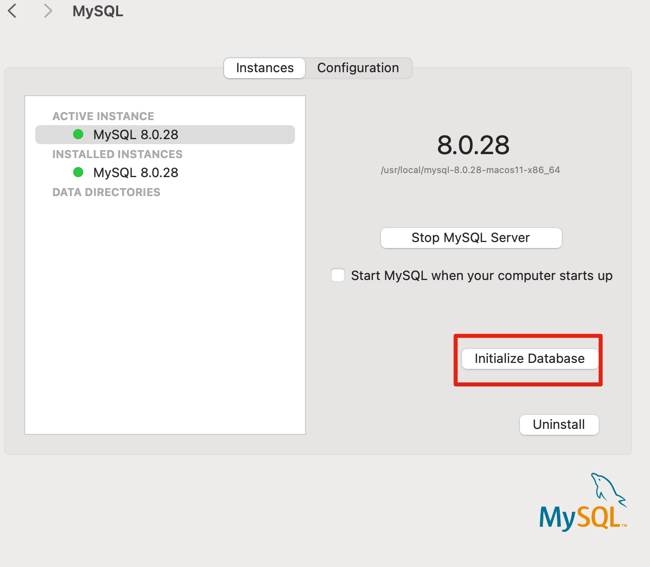

## 重置root用户密码

1. 停止 MySQL 服务：
   bash
   Copy code
   sudo /usr/local/mysql/support-files/mysql.server stop
2. 启动 MySQL 服务并跳过权限检查：
   bash
   Copy code
   sudo /usr/local/mysql/bin/mysqld_safe --skip-grant-tables &
3. 使用 root 身份登录 MySQL：
   bash
   Copy code
   mysql -u root
4. 更新 'root' 用户的密码：
      在 MySQL 命令行界面中执行以下命令来更新 'root' 用户的密码：
   ```mysql
    # 1.
    USE mysql;
    UPDATE mysql.user SET authentication_string = '123456' WHERE User = 'root';
    FLUSH PRIVILEGES;
   ```
5. 退出: quit
6. 停止 MySQL 服务：
   sudo /usr/local/mysql/support-files/mysql.server stop
7. 重启
   sudo /usr/local/mysql/support-files/mysql.server start

---

或者，直接 spotlight 搜索 mysql，如图：

点击初始化数据库，在弹出的窗口中输入 root 用户的密码。

