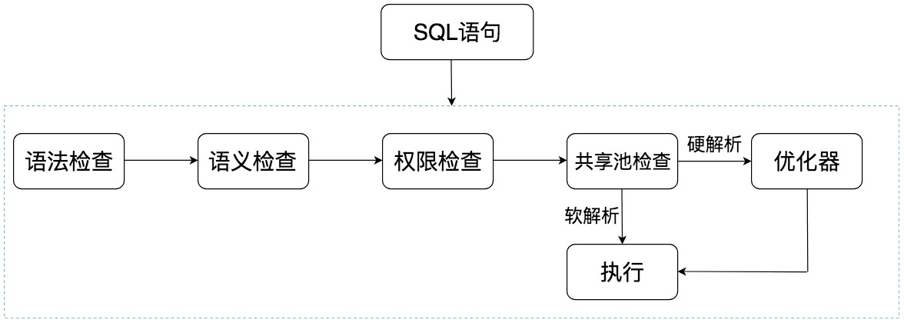
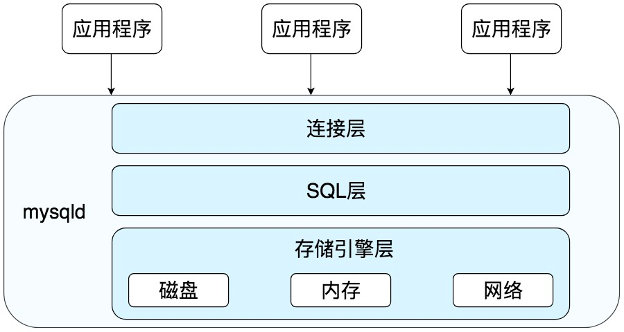
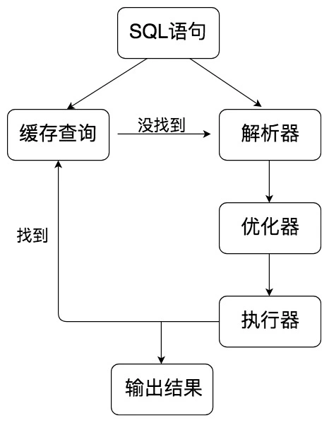

## 学会用数据库的方式思考SQL是如何执行的

- Oracle 中的 SQL 是如何执行的，什么是硬解析和软解析；
- MySQL 中的 SQL 是如何执行的，MySQL 的体系结构又是怎样的；
- 什么是存储引擎，MySQL 的存储引擎都有哪些？

### Oracle 中的 SQL 是如何执行的

语法检查：检查 SQL 拼写是否正确，如果不正确，Oracle 会报语法错误。
语义检查：检查 SQL 中的访问对象是否存在。比如我们在写 SELECT 语句的时候，列名写错了，系统就会提示错误。语法检查和语义检查的作用是保证 SQL 语句没有错误。
权限检查：看用户是否具备访问该数据的权限。
共享池检查：共享池（Shared Pool）是一块内存池，最主要的作用是缓存 SQL 语句和该语句的执行计划。Oracle 通过检查共享池是否存在 SQL 语句的执行计划，来判断进行软解析，还是硬解析。
    - 那软解析和硬解析又该怎么理解呢？在共享池中，Oracle 首先对 SQL 语句进行 Hash 运算，然后根据 Hash 值在库缓存（Library Cache）中查找，
        如果存在 SQL 语句的执行计划，就直接拿来执行，直接进入“执行器”的环节，这就是软解析。如果没有找到 SQL 语句和执行计划，Oracle 就需要创建解析树进
        行解析，生成执行计划，进入“优化器”这个步骤，这就是硬解析。
    - 优化器：优化器中就是要进行硬解析，也就是决定怎么做，比如创建解析树，生成执行计划。
    - 执行器：当有了解析树和执行计划之后，就知道了 SQL 该怎么被执行，这样就可以在执行器中执行语句了。

### MySQL 中的 SQL 是如何执行的

首先 MySQL 是典型的 C/S 架构，即 Client/Server 架构，服务器端程序使用的 mysqld。整体的 MySQL 流程如下图所示：

- 连接层：客户端和服务器端建立连接，客户端发送 SQL 至服务器端；
- SQL 层：对 SQL 语句进行查询处理；
- 存储引擎层：与数据库文件打交道，负责数据的存储和读取。

SQL层

