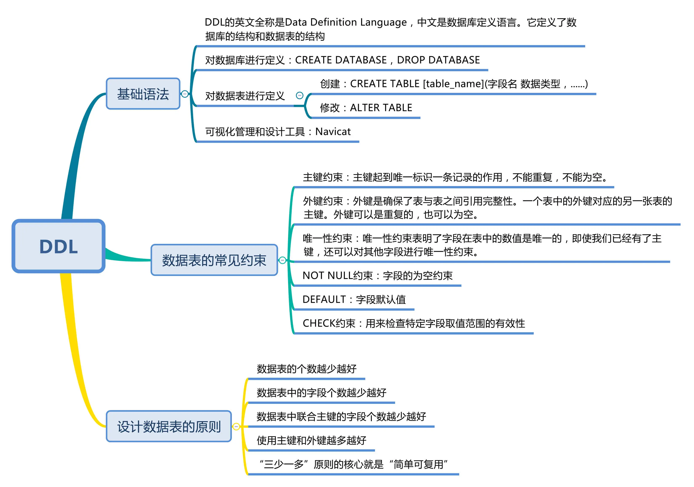

## 使用DDL创建数据库&数据表时需要注意什么？

以下几个角度来学习：
- 了解 DDL 的基础语法，它如何定义数据库和数据表；
- 使用 DDL 定义数据表时，都有哪些约束性；
- 使用 DDL 设计数据库时，都有哪些重要原则。

DDL 的基础语法及设计工具DDL 的英文全称是 Data Definition Language，中文是数据定义语言。它定义了数据库的结构和数据表的结构。在 DDL 中，
我们常用的功能是增删改，分别对应的命令是 CREATE、DROP 和 ALTER。需要注意的是，在执行 DDL 的时候，不需要 COMMIT，就可以完成执行任务。

### 对数据定义

```sql
CREATE DATABASE nba; // 创建一个名为nba的数据库
DROP DATABASE nba; // 删除一个名为nba的数据库
```

### 对数据表进行定义

```sql
CREATE TABLE [table_name](字段名 数据类型，......)
```

### 创建表结构
比如我们想创建一个球员表，表名为 player，里面有两个字段，一个是 player_id，它是 int 类型，另一个 player_name 字段是varchar(255)类型。
这两个字段都不为空，且 player_id 是递增的。那么创建的时候就可以写为：

```sql
CREATE TABLE player  (
  player_id int(11) NOT NULL AUTO_INCREMENT,
  player_name varchar(255) NOT NULL
);
```
实际上，我们通常很少自己写 DDL 语句，可以使用一些可视化工具来创建和操作数据库和数据表。在这里我推荐使用 Navicat，它是一个数据库管理和设计工具，
跨平台，支持很多种数据库管理软件

### 修改表结构

1. 添加字段，比如我在数据表中添加一个 age 字段，类型为int(11)
```sql
ALTER TABLE player ADD (age int(11));
```
2. 修改字段名，将 age 字段改成player_age: ```ALTER TABLE player RENAME COLUMN age to player_age3```
3. 修改字段的数据类型，将player_age的数据类型设置为float(3,1): ```ALTER TABLE player MODIFY (player_age float(3,1));```
4. 删除字段, 删除刚才添加的player_age字段: ```ALTER TABLE player DROP COLUMN player_age;```

### 数据表的常见约束

- 主键约束
- 外键约束
- 字段约束
  - 唯一性约束
  - NOT NULL
  - DEFAULT
  - CHECK 约束

### 设计数据表的原则

三多一少原则: 

- 数据表的个数越少越好
- 数据表中的字段个数越少越好
- 数据表中联合主键的字段个数越少越好
- 使用主键和外键越多越好



