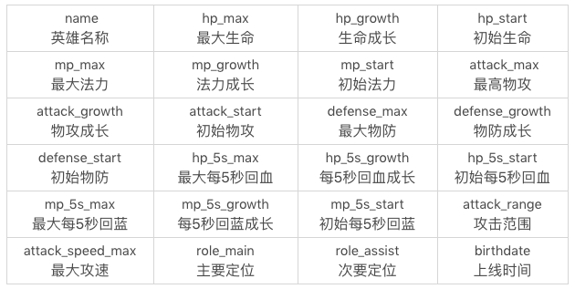
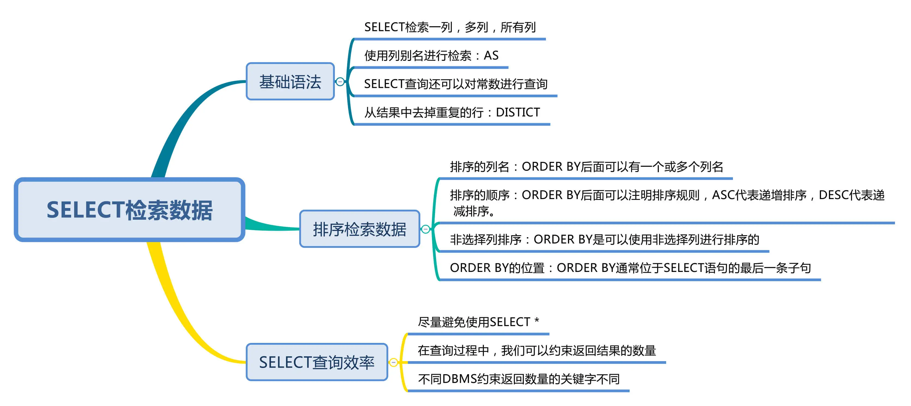

## 检索数据：你还在SELECT * 么？

**重点**

- [SELECT 查询的基础语法](#select-查询的基础语法)
- [如何排序检索数据](#如何排序检索数据)
- [约束返回结果数量](#约束返回结果的数量)
- [SELECT 的执行顺序](#select-的执行顺序)
- [SQL执行原理](#sql-执行原理)
- [什么情况下用SELECT*，如何提升 SELECT 查询效率？](#什么情况下用select如何提升-select-查询效率)

---

创建了一个王者荣耀英雄数据表，这张表里一共有 69 个英雄，23 个属性值（不包括英雄名 name）。[SQL 文件见](docs/heros_data_with_structure.sql)

字段含义:


### select 查询的基础语法

- 查询列
- 起别名
- 查询常数
- 去除重复行


#### 查询列

```sql
// 单列
select name from heros;

// 多列
SELECT name, hp_max, mp_max, attack_max, defense_max FROM heros;

// 所有列
SELECT * FROM heros;
```
注意: 生产环境时要尽量避免使用SELECT*

#### 起别名

```ELECT name AS n, hp_max AS hm, mp_max AS mm, attack_max AS am, defense_max AS dm FROM heros;```

运行结果和上面多列检索的运行结果是一样的，只是将列名改成了 n、hm、mm、am 和 dm。当然这里的列别名只是举例，一般来说起别名的作用是对原有名称进行简化，
从而让 SQL 语句看起来更精简。同样我们也可以对表名称起别名，这个在多表连接查询的时候会用到。

#### 查询常数

SELECT 查询还可以对常数进行查询。对的，就是在 SELECT 查询结果中增加一列固定的常数列。这列的取值是我们指定的，而不是从数据表中动态取出的。你可能
会问为什么我们还要对常数进行查询呢？SQL 中的 SELECT 语法的确提供了这个功能，一般来说我们只从一个表中查询数据，通常不需要增加一个固定的常数列，
但如果我们想整合不同的数据源，用常数列作为这个表的标记，就需要查询常数。

```mysql
SELECT '王者荣耀' as platform, name FROM heros;
```

结果:
```mysql
+--------------+--------------+
| platform     | name         |
+--------------+--------------+
| 王者荣耀     | 夏侯惇       |
| 王者荣耀     | 钟无艳       |
| 王者荣耀     | 张飞         |
| 王者荣耀     | 牛魔         |
+--------------+--------------+
```
在这个 SQL 语句中，我们虚构了一个platform字段，并且把它设置为固定值“王者荣耀”。需要说明的是，如果常数是个字符串，那么使用单引号（‘’）就非常重要了，
比如‘王者荣耀’。单引号说明引号中的字符串是个常数，否则 SQL 会把王者荣耀当成列名进行查询，但实际上数据表里没有这个列名，就会引起错误。如果常数是英文
字母，比如'WZRY'也需要加引号。如果常数是个数字，就可以直接写数字，不需要单引号，比如:

```mysql
SELECT 123 as platform, name FROM heros;
```

#### 去除重复行

比如我们想要看下 heros 表中关于攻击范围的取值都有哪些：
```mysql
SELECT DISTINCT attack_range FROM heros;
```
查询结果:
```mysql
+--------------+
| attack_range |
+--------------+
| 近战         |
| 远程         |
+--------------+
```

注意: 

- DISTINCT 需要放到所有列名的前面，如果写成SELECT name, DISTINCT attack_range FROM heros会报错
- DISTINCT 其实是对后面所有列名的组合进行去重


### 如何排序检索数据

order by:

- 排序的列名：ORDER BY 后面可以有一个或多个列名，如果是多个列名进行排序，会按照后面第一个列先进行排序，当第一列的值相同的时候，再按照第二列进行排序，以此类推
- 排序的顺序：ORDER BY 后面可以注明排序规则，ASC 代表递增排序，DESC 代表递减排序。如果没有注明排序规则，默认情况下是按照 ASC 递增排序。我们很容易理解 ORDER BY 对数值类型字段的排序规则，但如果排序字段类型为文本数据，就需要参考数据库的设置方式了，这样才能判断 A 是在 B 之前，还是在 B 之后。比如使用 MySQL 在创建字段的时候设置为 BINARY 属性，就代表区分大小写
- 非选择列排序：ORDER BY 可以使用非选择列进行排序，所以即使在 SELECT 后面没有这个列名，你同样可以放到 ORDER BY 后面进行排序
- ORDER BY 的位置：ORDER BY 通常位于 SELECT 语句的最后一条子句，否则会报错

想要显示英雄名称及最大生命值，按照最大生命值从高到低的方式进行排序：
```mysql
SELECT name, hp_max FROM heros ORDER BY hp_max DESC;
```

想要显示英雄名称及最大生命值，按照第一排序最大法力从低到高，当最大法力值相等的时候则按照第二排序进行，即最大生命值从高到低的方式进行排序：
```mysql
SELECT name, hp_max FROM heros ORDER BY mp_max, hp_max DESC;  
```

### 约束返回结果的数量

```mysql
SELECT name, hp_max FROM heros limit 5;  
```

有一点需要注意，约束返回结果的数量，在不同的 DBMS 中使用的关键字可能不同。在 MySQL、PostgreSQL、MariaDB 和 SQLite 中使用 LIMIT 关键字
，而且需要放到 SELECT 语句的最后面。如果是 SQL Server 和 Access，需要使用 TOP 关键字，比如:

```sql
SELECT TOP 5 name, hp_max FROM heros ORDER BY hp_max DESC;
```

如果是 DB2，使用FETCH FIRST 5 ROWS ONLY这样的关键字：
```db2
SELECT name, hp_max FROM heros ORDER BY hp_max DESC FETCH FIRST 5 ROWS ONLY;
```

如果是 Oracle，你需要基于 ROWNUM 来统计行数：
```oracle
SELECT name, hp_max FROM heros WHERE ROWNUM <=5 ORDER BY hp_max DESC;
```

约束返回结果的数量可以减少数据表的网络传输量，也可以提升查询效率。如果我们知道返回结果只有 1 条，就可以使用LIMIT 1，告诉 SELECT 语句只需要返回
一条记录即可。这样的好处就是 SELECT 不需要扫描完整的表，只需要检索到一条符合条件的记录即可返回。


### SELECT 的执行顺序

- 关键字的顺序是不能颠倒的
- SELECT 语句的执行顺序（在 MySQL 和 Oracle 中，SELECT 执行顺序基本相同）

#### 关键字的顺序是不能颠倒的

```sql
SELECT ... FROM ... WHERE ... GROUP BY ... HAVING ... ORDER BY ...
```

#### SELECT 语句的执行顺序（在 MySQL 和 Oracle 中，SELECT 执行顺序基本相同）

```sql
FROM > WHERE > GROUP BY > HAVING > SELECT的字段 > DISTINCT > ORDER BY > LIMIT
```

比如下面 SQL 语句，那么它的关键字顺序和执行顺序是下面这样的：
```sql
SELECT DISTINCT player_id, player_name, count(*) as num #顺序5
FROM player JOIN team ON player.team_id = team.team_id #顺序1
WHERE height > 1.80 #顺序2
GROUP BY player.team_id #顺序3
HAVING num > 2 #顺序4
ORDER BY num DESC #顺序6
LIMIT 2 #顺序7
```

在 SELECT 语句执行这些步骤的时候，每个步骤都会产生一个虚拟表，然后将这个虚拟表传入下一个步骤中作为输入。需要注意的是，这些步骤隐含在 SQL 的执行过程中，对于我们来说是不可见的。

### SQL 执行原理

SELECT 是先执行 FROM 这一步的。在这个阶段，如果是多张表联查，还会经历下面的几个步骤：

1. 首先先通过 CROSS JOIN 求笛卡尔积，相当于得到虚拟表 vt（virtual table）1-1；
2. 通过 ON 进行筛选，在虚拟表 vt1-1 的基础上进行筛选，得到虚拟表 vt1-2；
3. 添加外部行。如果我们使用的是左连接、右链接或者全连接，就会涉及到外部行，也就是在虚拟表 vt1-2 的基础上增加外部行，得到虚拟表 vt1-3。

当然如果我们操作的是两张以上的表，还会重复上面的步骤，直到所有表都被处理完为止。这个过程得到是我们的原始数据。当我们拿到了查询数据表的原始数据，也就是最终的虚拟表 vt1，就可以在此基础上再进行 WHERE 阶段。在这个阶段中，会根据 vt1 表的结果进行筛选过滤，得到虚拟表 vt2。然后进入第三步和第四步，也就是 GROUP 和 HAVING 阶段。在这个阶段中，实际上是在虚拟表 vt2 的基础上进行分组和分组过滤，得到中间的虚拟表 vt3 和 vt4。当我们完成了条件筛选部分之后，就可以筛选表中提取的字段，也就是进入到 SELECT 和 DISTINCT 阶段。首先在 SELECT 阶段会提取想要的字段，然后在 DISTINCT 阶段过滤掉重复的行，分别得到中间的虚拟表 vt5-1 和 vt5-2。当我们提取了想要的字段数据之后，就可以按照指定的字段进行排序，也就是 ORDER BY 阶段，得到虚拟表 vt6。最后在 vt6 的基础上，取出指定行的记录，也就是 LIMIT 阶段，得到最终的结果，对应的是虚拟表 vt7。当然我们在写 SELECT 语句的时候，不一定存在所有的关键字，相应的阶段就会省略。同时因为 SQL 是一门类似英语的结构化查询语言，所以我们在写 SELECT 语句的时候，还要注意相应的关键字顺序，所谓底层运行的原理，就是我们刚才讲到的执行顺序。


### 什么情况下用SELECT*，如何提升 SELECT 查询效率？

当我们初学 SELECT 语法的时候，经常会使用SELECT *，因为使用方便。实际上这样也增加了数据库的负担。所以如果我们不需要把所有列都检索出来，还是先指定出所需的列名，因为写清列名，可以减少数据表查询的网络传输量，而且考虑到在实际的工作中，我们往往不需要全部的列名，因此你需要养成良好的习惯，写出所需的列名。如果我们只是练习，或者对数据表进行探索，那么是可以使用SELECT *的。它的查询效率和把所有列名都写出来再进行查询的效率相差并不大。这样可以方便你对数据表有个整体的认知。但是在生产环境下，不推荐你直接使用SELECT *进行查询。

**思维导图**
