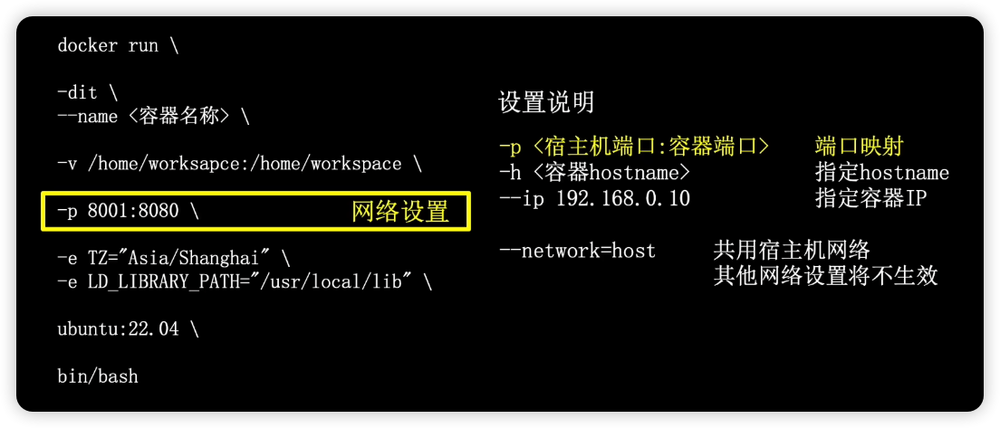
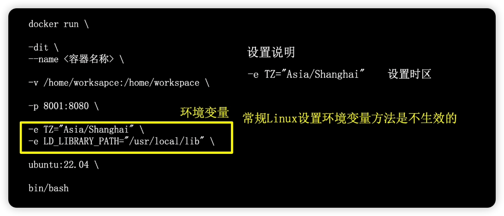
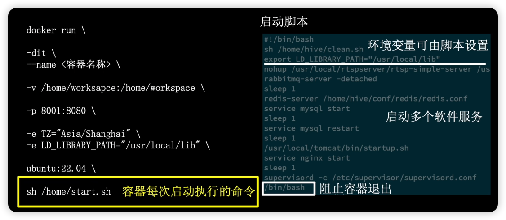

## docker

- docker安装官方说明：https://docs.docker.com/engine/install
- dockerHub镜像仓库：https://hub.docker.com
- docker快速入门: https://docker.easydoc.net/

### 工作原理

四个部分，如图:

### docker 镜像

- 镜像是容器的模板，等同于安装电脑操作系统的光盘；
- 镜像是只读的，不能对其进行修改
- Linux镜像可以在 Linux、Windows的 docker 中使用
- Windows镜像只能在 Windows 的docker 中使用

#### 镜像名称

mysql:5.7

- mysql 是镜像名；5.7 是tag版本，如果忽略tag版本默认会选择 latest

#### 镜像相关命令

- 查看本地镜像: `docker images`
- 搜索镜像仓库: `docker search <xxx>`
- 下载镜像: `docker pull <img_name:tag_version>`
- 上传镜像: `docker push <img_name:tag_version>`
- 删除镜像: `docker rmi <img_name:tag_version>`
- 打包本地镜像文件: `docker save -o <output file path> <img_name:tag_version>`
- 导入本地镜像文件: `docker load -i <load file path>`

### docker 容器

容器：真正运行的实例；隔离网络、文件、进程等环境；一个容器是一个沙盒隔离环境

#### 相对于虚拟机技术

docker 相对于虚拟机技术: 启动更快、更轻量；但是容器是公用宿主机的内存、CPU物理资源。多容器可能存在互相抢占资源的情况

#### 迁移容器到新服务器

#### 容器相关命令

- 查看本地容器: `docker ps`
  - ps： process status
- 查看所有容器(包括未运行): `docker ps -a`
- 启动容器: `docker start <容器ID>`
- 停止容器: `docker stop <容器ID>`
- 删除容器: `docker rm <容器ID>`
- 进入容器内部: `docker exec -it <容器ID> /bin/bash`
- 容器打包成镜像: `docker commit -a "作者信息" -m "log信息" <容器ID> <目标镜像名称:tag版本> `
- 拷贝文件到容器: `docker cp <文件目录> <容器ID>:<目标目录>`
- 拷贝容器文件到宿主机: `docker cp <容器ID>:<文件目录> <宿主机目标目录>`
- 更新容器设置: `docker update <容器ID> <相关设置>`

### 创建容器

两种方式:

- 通过命令直接创建
- 通过 dockerfile 创建

### 容器创建命令

基础参数

挂载宿主机目录

网路设置

环境变量设置

容器每次启动执行的命令

通过 shell脚本启动多个后台程序

