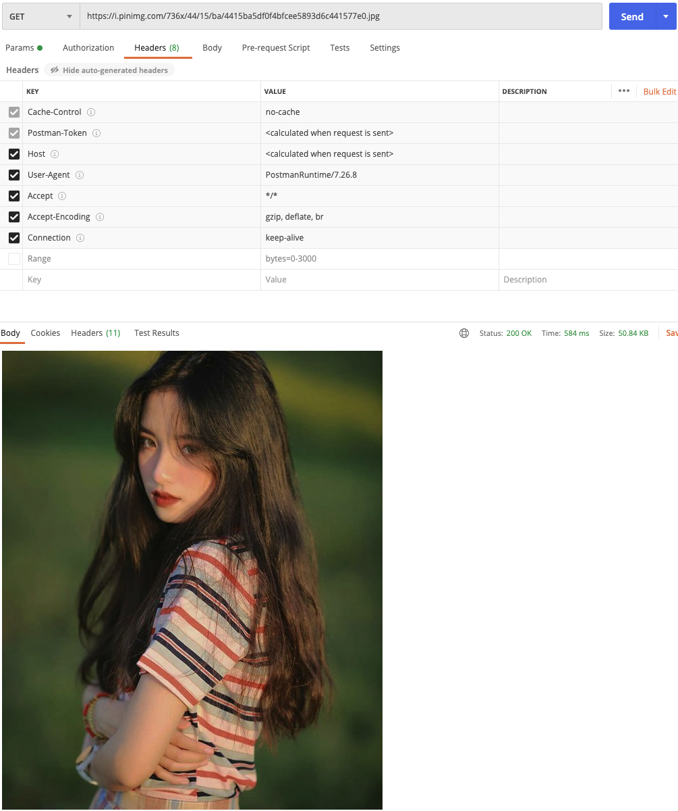
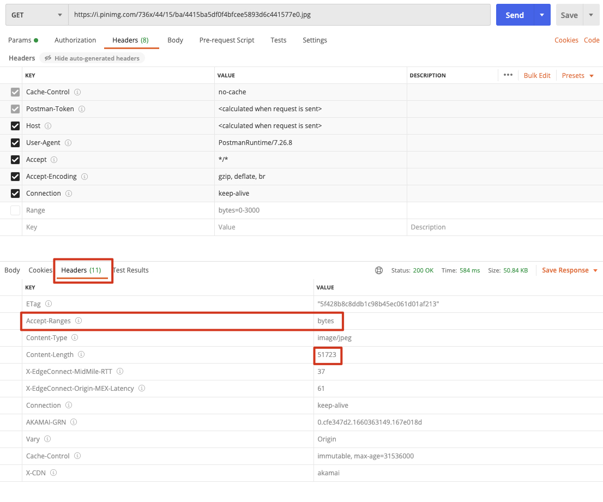
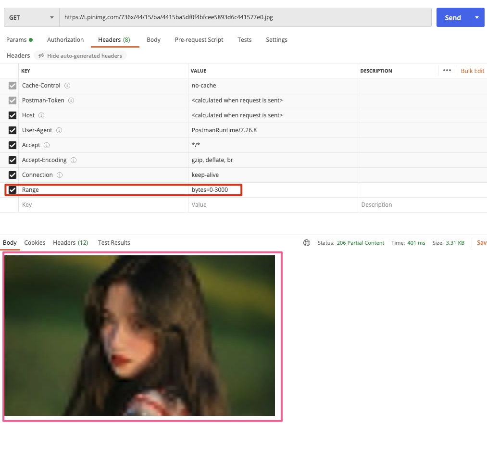

## Range / Accpet-Ranges

分段加载，比如从互联网上下载一张图片。

查看 Response Header 信息，如下：

有 Accept-Ranges 说明支持分段传输，按照 `bytes` 为单位。因此可以在 Request 的 Header 里面加上 `Range` 然后指定分段范围：`bytes=0-3000`，然后再次发送请求，结果如下：

图片只获取了一部分。

